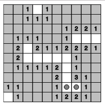

# Minesweeper
Javascript minesweeper game 



## Built With

* HTML
* CSS
* Javascript

## Installation

To run my application simply clone the project and run the html file.

## Usage

The object of the game is to clear the board without revealing any of the mines. 

## License

```Groovy
MIT License
